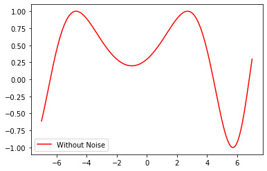
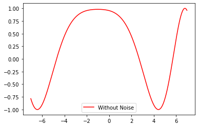
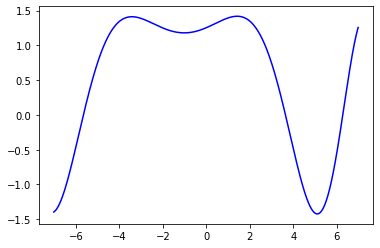
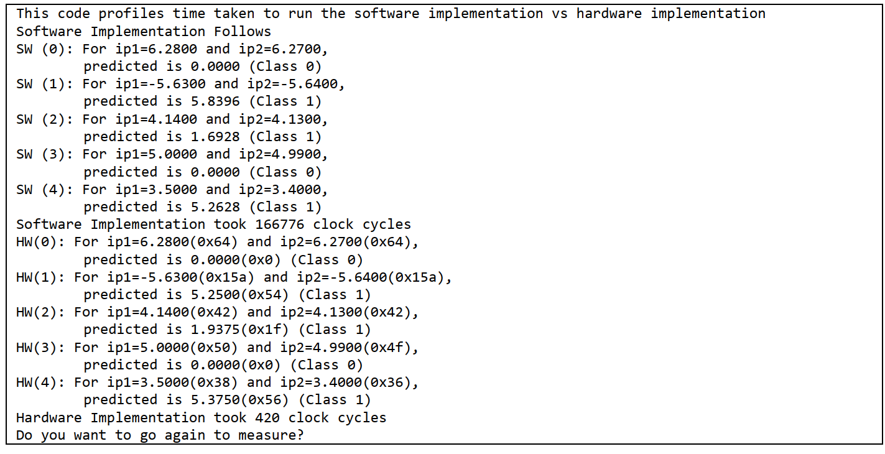

# <h1 align="center"> Deep Inference In FPGA</h1>


<h2>Project Description</h2>

A Deep Neural Network-inference accelerator is created in hardware. The codes for hardware is written in System Verilog. The hardware module is interfaced with NIOS computer system, thus this hardware acts as a peripheral to the computer system. The driver code to interface the hardware is written in C, and can be found in <a href="sources_NIOS/nios_NN_interface.c">sources_NIOS</a> folder.

A simple Neural Network implementation in software is also done in C. This implementation can be found in the same C file mentioned above.

<h2>Usage</h2>

1. Compile the System Verilog code in Intel Quartus or any other software (This step is unnecessary, and can be skipped if you do not want to check for errors).
2. Create a custom peripheral using the system Verilog codes provided.
3. Add the peripheral created above to your favorite computer system. The top level assumes NIOS computer system with Avalon interface. However, same System Verilog Code can be used to interface with ARM since the compiler will insert additional buses while compiling.
4. Use any software to program the computer system that you just used. Program the computer system with the C file provided, and watch the output.
5. Compare the results and performance between the hardware implementation and software implementation based on the result seen on terminal.
6. For your custom implementation, please train the network and generate weights and biases. Convert them to fixed point representation. You can update the specific locations in system Verilog code taking this implementation as reference.

<h2>Problem Definition</h2>

The problem that is being solved by the implementation is a classification  based on a complex mathematical function. (This mathematical function is, however, very simple compared to the real world problems that we face today. This is just an illustration.)

Here, two mathematical functions, `y1 = sin(x^2+2*x+3) ` and `y2 = cos(x^2+2*x+3)`. The domain of `x` taken for `y1` is `x1=[-7.00:7.00:0.01]` and for `y2` is `x2=[-7.01:6.99:0.01]`. The individual functions look as follows:



 and 



When we add these two functions, the added function with respect to `x1` looks like following:



We can take a threshold of 0.0 and create a classification problem out of this such that value 

```
Class Label 1 if f(x1,x2) = y1+y2 > 0.00
Class Label 0 if f(x1,x2) = y1+y2 <= 0.00
```

<h2>Implementation Details</h2>

1. Activation of ReLU is used because it is simple.
2. The weights and inputs are float for training. Training is done in <a href="https://scikit-learn.org/stable/modules/generated/sklearn.neural_network.MLPClassifier.html">SKLearn using MLP Classifier</a>.
3. For hardware implementation, the weight values  and biases are converted to Fixed Point Implementation. 9 bit representation with 4 places of fractional part is used because DE2-115 platform has 9-bit multiplication modules.
4. Python scripts are used to automatically generate the codes for Single Layer and Neural Network. These codes are not released however. Please let me know and I will release them personally.
5. Software Implementation of NN in NIOS is done using floating point representation.
6. The implementation in hardware is fully combinational. This might be optimal for resource usage. All the implementation boils down to multiplication routine. There is a sequential multiplication routine as well. Please fee free to modify the code using sequential multiplication routine so that resource utilization is optimized.

<h2>Results and Comparison</h2>

Following shows the result obtained by running the implementation:



We can see the speed up achieved is 400 times.